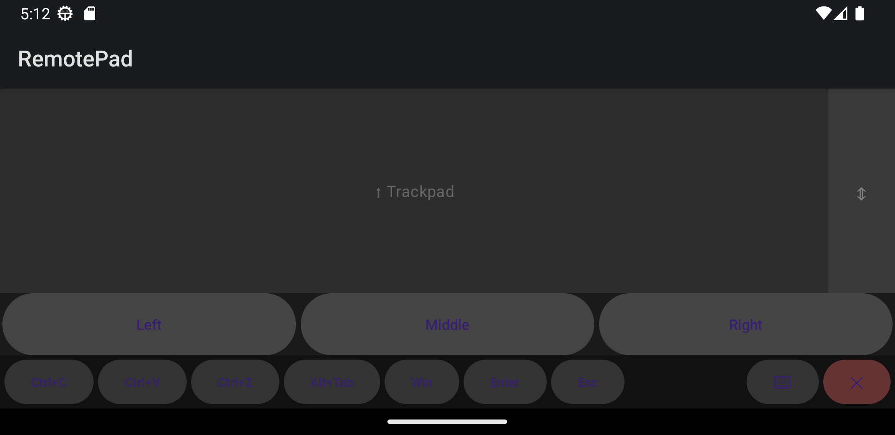

# RemotePad

Turn your Android phone into a wireless **trackpad and keyboard** for your Windows 11 PC.

RemotePad pairs a Jetpack Compose Android client with a lightweight Python
server that runs in the Windows system tray. The phone becomes a multi-touch
trackpad — move, tap, scroll, pinch-to-zoom, adjust volume — plus a shortcut
bar and full text input, while the server replays those gestures as real
mouse and keyboard events on the PC.



## Features

- **Multi-touch trackpad** — pointer movement, tap / double-tap, two-finger
  scroll, pinch-to-zoom, and two-finger vertical drag for volume.
- **Shortcut bar** — one-tap Ctrl+C / Ctrl+V / Ctrl+Z, Alt+Tab, Win, Enter, Esc.
- **Text & key input** — type from the phone keyboard; send key combos.
- **Visual feedback** — the server streams a small live thumbnail of the
  screen area around the cursor back to the phone (~10 FPS).
- **PIN authentication** — a 4-digit PIN, regenerated every launch, with
  per-client rate limiting and lockout.
- **System tray server** — shows the PIN and connection info; no window needed.

## Architecture

```
Android app (Kotlin / Jetpack Compose)
        │   JSON messages over WebSocket (default port 9876)
        ▼
Windows server (Python 3.12 / asyncio / websockets)
        │   pynput
        ▼
Windows mouse & keyboard
```

The message protocol is plain JSON (`mouse_move`, `mouse_click`,
`mouse_scroll`, `key_press`, `key_combo`, `text_input`, `zoom`, `auth`).

## Requirements

- **Server:** Windows 11, Python 3.12
- **Client:** Android 8.0 (API 26) or newer
- Phone and PC on the **same local network**

## Getting started

### Server (Windows PC)

```bash
# from the repository root
python -m venv .venv
.venv\Scripts\pip install -r requirements.txt
.venv\Scripts\python -m server
```

A green icon appears in the system tray and a notification shows the current
**PIN** and the PC's LAN IP. The server listens on port `9876` by default.

Configuration lives in `config.json` (created on first run from the defaults;
see `config.example.json`):

| Key         | Default     | Meaning                                    |
|-------------|-------------|--------------------------------------------|
| `host`      | `0.0.0.0`   | Bind address (`127.0.0.1` = loopback only) |
| `port`      | `9876`      | WebSocket port                             |
| `log_level` | `INFO`      | Logging verbosity                          |
| `auto_start`| `false`     | Reserved                                   |

### Client (Android)

Open the project in `android/` with Android Studio and run it on your phone,
or build a release APK with `./gradlew assembleRelease`. On the connection
screen, enter the PC's IP, the port, and the PIN shown in the tray.

## Testing

The server has an extensive test suite (unit + end-to-end over real
WebSocket connections):

```bash
.venv\Scripts\pip install -r requirements-dev.txt
.venv\Scripts\pytest tests/ -v --cov=server
```

The Android client has JUnit tests under `android/app/src/test`, runnable with
`./gradlew test`.

## Security notice

**Read this before running RemotePad.**

By design, any authenticated client gains **full keyboard and mouse control**
of the host PC — including the ability to open a shell and run commands. That
is functionally equivalent to remote code execution, which is inherent to any
remote-control tool. The safeguards are a per-session PIN (generated with a
cryptographic RNG and compared in constant time) with lockout after repeated
failures.

However:

- The transport is **unencrypted** (`ws://`). Anyone able to observe the
  network can see the traffic, including keystrokes.
- By default the server **binds to all interfaces** (`0.0.0.0`) so the phone
  can reach it over WiFi; it logs a warning when it is not loopback-only.

Therefore: **run RemotePad only on a trusted private network, or tunnel it
over a VPN.** Do not expose the server port to the public internet. To limit
exposure to the local machine while testing, set `"host": "127.0.0.1"` in
`config.json`.

## Bluetooth support (work in progress)

A Bluetooth (RFCOMM) transport exists in the codebase as an alternative to
WiFi, but it is **not finished and is disabled by default.** The runtime
permissions required on Android 12+ are not yet requested, so the Bluetooth
path is gated off (`ConnectionManager(bluetoothEnabled = false)`) and the app
uses WiFi only. Do not rely on Bluetooth in the current version.

## License

[MIT](LICENSE) © 2026 Stéphane Hercot
