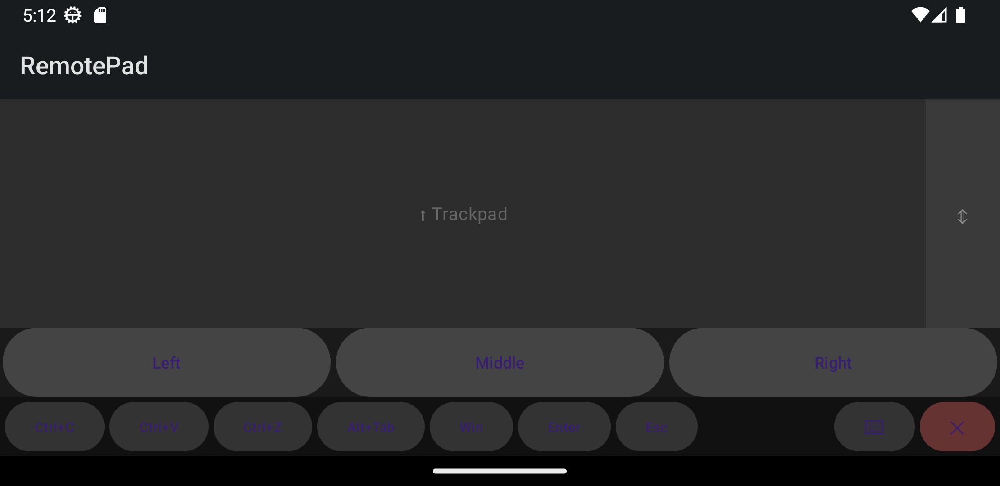

# RemotePad

Turn your Android phone into a wireless **trackpad and keyboard** for your Windows 11 PC.


RemotePad pairs a Jetpack Compose Android client with a lightweight Python
server that runs in the Windows system tray. The phone becomes a multi-touch
trackpad — move, tap, scroll, pinch-to-zoom, adjust volume — plus a shortcut
bar and full text input, while the server replays those gestures as real
mouse and keyboard events on the PC.



## Table of contents

- [Why RemotePad](#why-remotepad)
- [Features](#features)
- [Project status](#project-status)
- [Requirements](#requirements)
- [Installation](#installation)
- [Configuration](#configuration)
- [Usage](#usage)
- [Architecture](#architecture)
- [Testing](#testing)
- [Building & deployment](#building--deployment)
- [Versioning & changelog](#versioning--changelog)
- [Roadmap](#roadmap)
- [Security](#security)
- [Contributing](#contributing)
- [License](#license)

## Why RemotePad

Controlling a PC from the couch (media playback, presentations, a PC plugged
into a TV) usually means a dedicated wireless mouse/keyboard or a closed-source
remote app. RemotePad is a small, self-hosted, open-source alternative: the
phone you already have, a tray app on the PC, and a documented JSON protocol
on your local network — no account, no cloud relay.

## Features

- **Multi-touch trackpad** — pointer movement, tap / double-tap, two-finger
  scroll, pinch-to-zoom (sent as Ctrl+wheel), and two-finger vertical drag
  for volume.
- **Mouse buttons** — dedicated Left / Middle / Right buttons.
- **Shortcut bar** — one-tap Ctrl+C / Ctrl+V / Ctrl+Z, Alt+Tab, Win, Enter, Esc.
- **Text & key input** — type from the phone keyboard; send key combos.
- **Settings** — adjustable mouse and scroll sensitivity, persisted on the phone.
- **Visual feedback** — the server streams a small live thumbnail of the
  screen area around the cursor back to the phone (~10 FPS).
- **PIN authentication** — a 4-digit PIN, regenerated every launch, with
  per-client rate limiting and lockout.
- **System tray server** — shows the PIN, connection info and version; no window needed.

## Project status

**Active — personal project, usable day to day over WiFi.**

| Component       | Current version |
|-----------------|-----------------|
| Android client  | 1.2.3           |
| Windows server  | 1.2.3           |

The Bluetooth transport is a work in progress and disabled (see
[Bluetooth support](#bluetooth-support-work-in-progress)).

## Requirements

- **Server:** Windows 11, Python 3.12
- **Client:** Android 8.0 (API 26) or newer
- **To build the client:** Android Studio (or the Gradle wrapper) with a JDK
- Phone and PC on the **same local network**

## Installation

### Server (Windows PC)

```bash
# from the repository root
python -m venv .venv
.venv\Scripts\pip install -r requirements.txt
.venv\Scripts\python -m server
```

Runtime dependencies (pinned in `requirements.txt`): `websockets`, `pynput`,
`pystray`, `pillow`.

### Client (Android)

Open the `android/` project in Android Studio and run it on your phone, or
build an APK from the command line (see
[Building & deployment](#building--deployment)).

## Configuration

### Server — `config.json`

`config.json` sits next to the server (repository root, or next to the
executable when packaged). It is created on first run from the defaults and
is not versioned; `config.example.json` shows the format.

| Key          | Default   | Meaning                                    |
|--------------|-----------|--------------------------------------------|
| `host`       | `0.0.0.0` | Bind address (`127.0.0.1` = loopback only) |
| `port`       | `9876`    | WebSocket port                             |
| `log_level`  | `INFO`    | Logging verbosity                          |
| `auto_start` | `false`   | Reserved                                   |

Logs are written to `remotepad.log` in the same directory (the PIN and LAN IP
are never logged). No environment variables are required.

### Client — signing (`android/keystore.properties`)

Release signing credentials are read from `android/keystore.properties`
(gitignored). Copy `android/keystore.properties.example` and fill in
`storeFile`, `storePassword`, `keyAlias` and `keyPassword` for your own
keystore. Without it, the debug build falls back to the default Android
debug key.

## Usage

1. Start the server. A green icon appears in the system tray and a
   notification shows the current **PIN** and the PC's LAN IP.
2. On the phone, open RemotePad and enter the PC's IP, the port (`9876` by
   default) and the PIN.
3. Use the trackpad area, the mouse buttons, the shortcut bar, or the
   keyboard button to type text.

Example of a protocol message sent by the client:

```json
{ "type": "mouse_move", "dx": 12, "dy": -4 }
```

## Architecture

```
Android app (Kotlin / Jetpack Compose, OkHttp)
        │   JSON messages over WebSocket (default port 9876)
        ▼
Windows server (Python 3.12 / asyncio / websockets, pystray tray)
        │   pynput                         ▲ screen thumbnail (Pillow)
        ▼                                  │
Windows mouse & keyboard ──────────────────┘
```

The message protocol is plain JSON (`auth`, `mouse_move`, `mouse_click`,
`mouse_scroll`, `key_press`, `key_combo`, `text_input`, `zoom`, …). Incoming
messages are size-bounded and every field is validated server-side.

```
.
├── android/                 Android client (Gradle project)
│   └── app/src/
│       ├── main/…/remotepad/
│       │   ├── ui/          Compose screens (connection, trackpad, settings)
│       │   ├── input/       touch / motion / keyboard processing
│       │   ├── network/     WebSocket & Bluetooth clients, serializer
│       │   └── viewmodel/   state, validation, preferences
│       └── test/            JUnit tests
├── server/                  Python server (python -m server)
│   ├── server.py            WebSocket server & message dispatch
│   ├── auth_manager.py      PIN generation, rate limiting, lockout
│   ├── input_controller.py  pynput mouse/keyboard
│   ├── screen_capture.py    cursor-area thumbnail
│   ├── tray.py              system tray icon & menu
│   └── config.py / messages.py / log_manager.py / bt_server.py / transport.py
├── tests/                   pytest suite for the server
├── specs/                   design specs (French)
├── docs/assets/             screenshots
├── RemotePad.spec           PyInstaller build spec
└── config.example.json      server configuration template
```

## Testing

**Server** — unit tests (auth, config, messages, input controller, logging,
Bluetooth server, WebSocket server) plus end-to-end tests over real WebSocket
connections:

```bash
.venv\Scripts\pip install -r requirements-dev.txt
.venv\Scripts\pytest tests/ -v --cov=server
```

**Android** — JUnit tests under `android/app/src/test` (input processing,
network clients and serialization, connection view model):

```bash
cd android
gradlew.bat test
```

## Building & deployment

**Server executable** — a single-file Windows executable is built with
PyInstaller (included in `requirements-dev.txt`):

```bash
.venv\Scripts\pyinstaller RemotePad.spec
# output: dist\RemotePad.exe
```

**Android APK:**

```bash
cd android
gradlew.bat assembleDebug     # app/build/outputs/apk/debug/app-debug.apk
gradlew.bat assembleRelease   # requires keystore.properties
```

Debug and release builds are signed with the same key when the keystore is
present, so either can be installed over the other.

## Versioning & changelog

Both components follow [Semantic Versioning](https://semver.org/). The version
is visible at runtime: in the footer of the Android connection screen, and in
the server's startup log, tray tooltip and tray menu. All notable changes are
recorded in [CHANGELOG.md](CHANGELOG.md) (Keep a Changelog format).

## Roadmap

- Finish the Bluetooth (RFCOMM) transport: request Android 12+ runtime
  permissions, then re-enable it.
- Verify the install/update flow on a physical device with the unified
  signing key.

## Security

**Read this before running RemotePad.**

By design, any authenticated client gains **full keyboard and mouse control**
of the host PC — including the ability to open a shell and run commands. That
is functionally equivalent to remote code execution, which is inherent to any
remote-control tool. The safeguards are a per-session PIN (generated with a
cryptographic RNG and compared in constant time) with lockout after repeated
failures.

However:

- The transport is **unencrypted** (`ws://`). Anyone able to observe the
  network can see the traffic, including keystrokes.
- By default the server **binds to all interfaces** (`0.0.0.0`) so the phone
  can reach it over WiFi; it logs a warning when it is not loopback-only.

Therefore: **run RemotePad only on a trusted private network, or tunnel it
over a VPN.** Do not expose the server port to the public internet. To limit
exposure to the local machine while testing, set `"host": "127.0.0.1"` in
`config.json`.

Sensitive files are kept out of the repository: `config.json`,
`remotepad.log`, `android/keystore.properties` and the keystore itself are
gitignored.

**Reporting a vulnerability:** please do not publish exploit details in a
public issue. Open a short issue asking for a private contact channel (or
reach the author through their GitHub profile), and the details will be
handled privately.

### Bluetooth support (work in progress)

A Bluetooth (RFCOMM) transport exists in the codebase as an alternative to
WiFi, but it is **not finished and is disabled by default.** The runtime
permissions required on Android 12+ are not yet requested, so the Bluetooth
path is gated off (`ConnectionManager(bluetoothEnabled = false)`) and the app
uses WiFi only. Do not rely on Bluetooth in the current version.

## Contributing

This is a personal project, but issues and pull requests are welcome. Please
keep changes focused, run the server and Android test suites before
submitting, and add an entry under `[Unreleased]` in
[CHANGELOG.md](CHANGELOG.md).

## License

[MIT](LICENSE) © 2026 Stéphane Hercot

**Author:** Stéphane Hercot ([@StephaneHe](https://github.com/StephaneHe))
